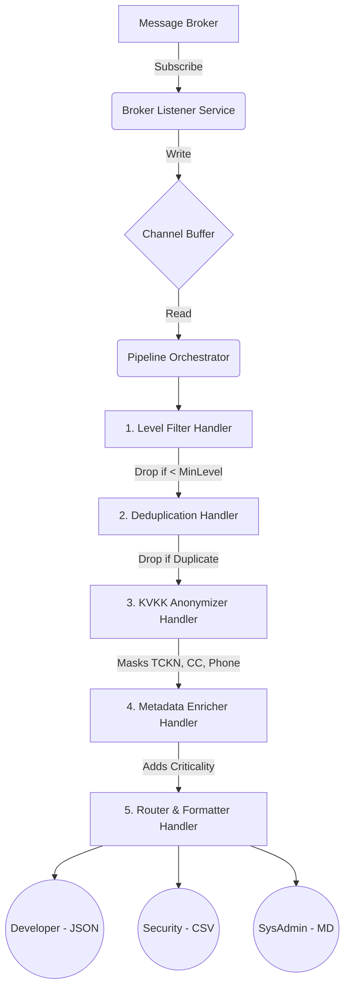

# Exchange Log Middleware 🚀

An enterprise-grade, highly scalable, and observable logging middleware solution designed to process high-frequency log streams from stock exchange systems. It features a fully asynchronous pipeline, pattern-based design (Strategy, Adapter, Chain of Responsibility), and seamless integration with multiple message brokers (RabbitMQ & Azure Service Bus).

## 🏗 Architecture Overview

The system is split into two primary components running as Docker containers:

1. **ExchangeLogMiddleware.Producer**: A background service acting as a simulated stock exchange log generator. It creates mock payloads with sensitive data (PII) at configurable rates and pushes them to the active message broker.
2. **ExchangeLogMiddleware.Middleware**: The core pipeline service. It consumes logs from the message broker, buffers them using `System.Threading.Channels`, and orchestrates them through an asynchronous pipeline (Chain of Responsibility) to filter, deduplicate, anonymize, enrich, and finally route the logs to their target roles using formatters (Strategy Pattern).

### Pipeline Flow



## 🛠 Tech Stack

- **.NET 8** (C#, Worker Services)
- **Message Brokers**: RabbitMQ, Azure Service Bus (via ASB Emulator)
- **Design Patterns**: Adapter, Strategy, Chain of Responsibility, Options Pattern
- **Infrastructure**: Docker & Docker Compose, Azure SQL Edge (for ASB Emulator state)

---

## 🚀 Getting Started

### Prerequisites
- [Docker](https://docs.docker.com/get-docker/) & Docker Compose installed.
- .NET 8 SDK (if you wish to build locally).

### 1. Configure the Environment
A default `.env` file should be present in the root directory. You can switch the active broker provider by changing `BROKER_PROVIDER`:

```env
# Broker Config (Options: RabbitMQ | AzureServiceBus)
BROKER_PROVIDER=AzureServiceBus

# RabbitMQ Settings
RABBITMQ_HOST=exchange-rabbitmq
RABBITMQ_USER=guest
RABBITMQ_PASS=guest
RABBITMQ_QUEUE=exchange-logs

# Azure Service Bus Emulator Settings
ASB_CONNECTION_STRING=Endpoint=sb://exchange-servicebus-emulator;SharedAccessKeyName=RootManageSharedAccessKey;SharedAccessKey=SAS_KEY_VALUE;UseDevelopmentEmulator=true;
ASB_QUEUE=exchange-logs
```

### 2. Run the Application
Start the infrastructure (Brokers, Producer, Middleware) using Docker Compose:

```bash
docker-compose up -d --build
```
> **Note:** If you are using Azure Service Bus, it may take around 30-45 seconds for the ASB Emulator and SQL Edge containers to fully initialize their databases. The middleware and producer will automatically retry connecting using Polly resilience policies.

### 3. Observe the Logs & Metrics
The middleware automatically reports processing metrics every 5 seconds. Check the logs:

```bash
docker logs -f exchange-middleware
```
You should see output similar to:
`[METRICS] TotalReceived: 454 | DroppedByFilter: 325 | SuccessfullyProcessed: 129 | Throughput: 2.0 msg/s`

### 4. View Output Files
The pipeline produces role-specific output files inside the `output/` directory mapped via Docker volumes.
Check the local `output` folder in the project root:
- `developer.jsonl`: JSON Lines format.
- `security.csv`: Comma-separated values format.
- `sysadmin.md`: Markdown format with key-value pairs.

### 5. Stop the Environment
```bash
docker-compose down
```

---

## 🧪 Testing and Validation
An automated End-to-End (E2E) validation script is provided. It automatically checks container health, validates the structure of the output files (JSON, CSV, MD), verifies KVKK/PII masking, and asserts that metrics are correctly tracked.

```powershell
.\scripts\validate-e2e.ps1
```

### Measuring Middleware Performance
To demonstrate the middleware's performance capabilities (throughput) under a high-volume load:
1. Open the `.env` file in the project root.
2. Change `PRODUCER_LOGS_PER_SECOND` to a very high value (e.g., `2000` or `5000`).
3. Re-create the containers to apply the new settings:
   ```bash
   docker-compose up -d
   ```
4. Follow the middleware logs to watch the live `Throughput` metric:
   ```bash
   docker logs -f exchange-middleware
   ```
You will see the pipeline efficiently processing thousands of messages per second in real-time.

---

## 🏗 Configuration Details

| Environment Variable | Service | Description |
|----------------------|---------|-------------|
| `BROKER_PROVIDER`    | Both | Dictates which broker to use: `RabbitMQ` or `AzureServiceBus`. |
| `PIPELINE_MINIMUM_LOG_LEVEL` | Middleware | Minimum log level to process (INFO, WARN, ERROR, CRITICAL). Logs below this are dropped. |
| `PIPELINE_DEDUP_CACHE_TTL_MINUTES` | Middleware | How long the middleware should cache `MessageId`s to prevent duplicate processing. |
| `PRODUCER_LOGS_PER_SECOND` | Producer | How many logs the producer should attempt to generate per second. |
| `PRODUCER_ERROR_RATE` | Producer | Probability (0.0 to 1.0) of generating an ERROR or CRITICAL log. |

## 🛡 Design & SOLID Principles
- **S**ingle Responsibility Principle: Each pipeline handler performs exactly one action (e.g. `KvkkAnonymizerHandler` only masks PII).
- **O**pen/Closed Principle: The pipeline can be extended by adding new Handlers, and new formatters can be added by implementing `IFormatterStrategy` without changing the router.
- **L**iskov Substitution Principle: `RabbitMqAdapter` and `AzureServiceBusAdapter` can be interchanged transparently via the `IMessageBroker` interface.
- **I**nterface Segregation Principle: Broker, Formatter, and Handler interfaces are kept minimal.
- **D**ependency Inversion Principle: The system relies on interfaces, not concrete implementations, constructed using the .NET DI container.
