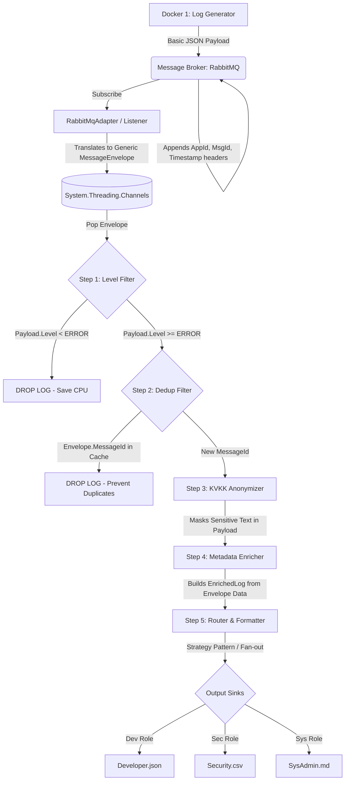

# CENG302 - Pipeline Data Flow & Architectural Decisions

## 1. Core Philosophy
This document explains the "How" and "Why" of the CENG302 Data Middleware System. It serves as the ultimate source of truth for the system's architecture. The AI Agent MUST strictly adhere to this flow, the order of execution, and the underlying architectural decisions. Do NOT optimize away or reorder these design choices.

## 2. Visual Architecture (Mermaid)

## 3. Step-by-Step Data Flow

### Phase 1: Generation (The Lean Producer)

* **Action:** The Generator produces a lightweight structured JSON log containing only `Level`, `Category`, `Message`, and `RawData`. It does NOT generate timestamps, sender IDs, or transaction IDs within the JSON payload. It MUST set these metadata values on the `IMessageBroker` envelope properties/headers before publishing.
* **Decision Rationale:** Separation of Concerns. The application code shouldn't worry about tracing details. We leverage the Message Broker's native properties to carry context (Enterprise Standard). The `Category` is provided specifically to guide the routing later.

### Phase 2: Boundary Translation & Buffering (The Shock Absorber)

* **Action:** The `RabbitMqAdapter` reads the broker-specific message, maps the headers and JSON body into a generic `MessageEnvelope<T>`, and pushes it to `System.Threading.Channels`.
* **Decision Rationale:** The Dependency Inversion Principle. The internal pipeline MUST NOT know about RabbitMQ or Azure Service Bus. By translating at the boundary, the inner logic works solely with `MessageEnvelope`. The Channel acts as an in-memory buffer, allowing worker threads to process logs safely and asynchronously during the required stress test without memory leaks.

### Phase 3: The Chain of Responsibility (Processing)

The log passes through strict, isolated handlers in this EXACT order:

1. **Performance Level Filter (Fail Fast):**
* Checks `MinimumLogLevel` (e.g., ERROR) from settings against `Envelope.Payload.Level`. Drops INFO/WARN logs immediately.
* **Rationale:** Fulfills the assignment's "performance via filtering" requirement. Drops noise at the very beginning of the pipeline before it consumes CPU for caching, regex, or formatting.

2. **Deduplication Filter (Idempotent Consumer):**
* Checks the `Envelope.MessageId` against an `IMemoryCache`. Drops the log if it exists.
* **Rationale:** Message brokers guarantee "at-least-once" delivery, meaning duplicate messages can occur during network blips. This layer ensures data integrity.

3. **KVKK Anonymizer:**
* Scans the `Envelope.Payload.Message` and `Envelope.Payload.RawData` for sensitive data (TCKN, Credit Cards) and masks them.
* **Rationale:** Privacy must be applied *before* any enrichment or routing to ensure no raw data leaks into output files.

4. **Broker Metadata Enricher:**
* Extracts `SenderId`, `MessageId` (Transaction No), and `Timestamp` directly from the `MessageEnvelope`. Calculates "Criticality" based on the `Payload.Level`. Injects these as tags into the final `EnrichedLog` object.
* **Rationale:** Fulfills the assignment's requirement to add specific tags without relying on brittle text-parsing (Regex). It ensures enterprise-grade reliability and 100% accuracy.

### Phase 4: Routing & Formatting (Multicast / Fan-out)

* **Action:** The system reads the `Category` of the enriched log and maps it to target roles (e.g., Database -> Developer, Auth -> Security). If a log applies to multiple roles, it is duplicated in memory (Fan-out). The Strategy pattern then applies the correct formatting (`.json`, `.csv`, `.md`) and writes to the shared Docker volume concurrently.
* **Decision Rationale:** Fulfills the assignment's requirement for role-based customized output formats. The Factory/Strategy combination ensures that adding a new role or format in the future requires zero changes to the core pipeline (Open/Closed Principle).

## 4. Immutable Engineering Rules for AI

* **Strict Ordering:** The pipeline steps must NEVER be reordered. Filtering must happen first; formatting must happen last.
* **Pluggable Brokers:** The connection to the broker MUST be abstracted behind an `IMessageBroker` interface.
* **Thread-Safe I/O:** File writing in the final step must handle concurrent writes gracefully (e.g., using `SemaphoreSlim` or asynchronous streams) since multiple logs might hit the same output file simultaneously from the Channels workers.
